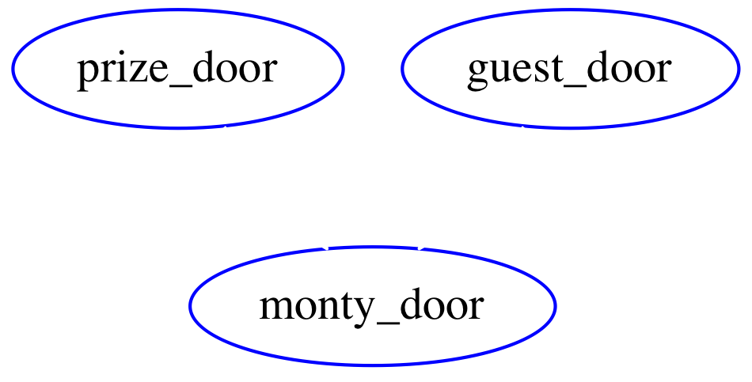
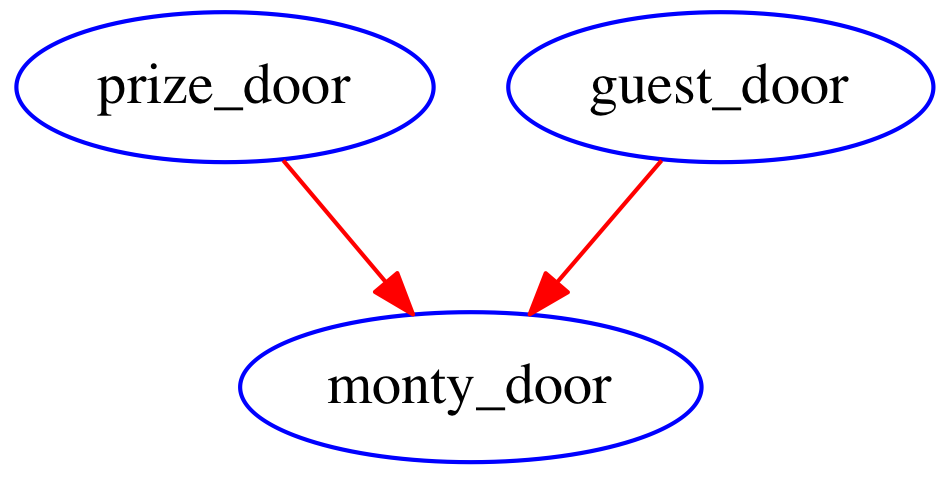

============
Introduction
============
.. sectnum::

This short tutorial will show you how
to build and perform exact inference
on a simple Bayesian Belief Network.

The problem we will be modelling is the
famous `Monty Hall Problem <http://en.wikipedia.org/wiki/Monty_Hall_problem>`_.
We choose the Monty Hall Problem as it has several
features that make it ideal for a tutorial
of this nature:

* It is a small problem, having only three variables
* It has an interesting and un-expected outcome (at first!)
* The conditional probabilities are simple to code in a few lines of Python

====================
Statement of Problem
====================
A television game show works as follows:

A host, by the name of Monty Hall, invites
a guest to select one of three doors.
He explains to the guest that behind
one of the doors is a car, and behind
each of the other two, a goat.
The host however does
not tell the guest which item is hidden
behind each door.

.. note::

The guest gets to keep the item that
is behind his choice of door.

.. note:: We will assume that the guest has no prior knowledge of what is hidden behind each door.
	  Further we will assume that for most guests its more desirable to win a car than a goat!

After making his initial choice, Monty
makes the game more interesting by
opening one of the two remaining doors.

.. note:: Since Monty Hall *knows* which door conceals
	  the car he will never open that door so he
	  will always reveal a goat.

After opening one of the doors, Monty
now offers the guest the opportunity to
switch his original choice of door.

The question we are trying to
answer is:

**Does it matter whether the guest sticks with their original
choice of door or should he switch doors?**

Many people are inclined to say that it
does not matter.

============================
Building The Model in Python
============================

Building Bayesian Belief Network models
with this package is very straight forward providing
we follow some simple conventions and rules.

Identify the Variables
----------------------

Firstly for any problem we are trying to
model it helps to identify the variables (strictly `Random Variables <http://en.wikipedia.org/wiki/Random_variable>`_)

For the Monty Hall problem it further helps to
think of the problem in terms of *events*. (This is not necessarily the case for all problems)

In the Monty hall problem, the following events occur, listed in chronological order:

1. The car is hidden behind one of the three doors prior to the guest arriving
2. The guest selects a door
3. Monty hall opens one of the two remaining doors

Each of the above events will be a **variable** in our model.
Lets call these variables:

1. prize_door
2. guest_door
3. monty_door

Identify the Possible Values for the Variables
----------------------------------------------

Now when we are building a Bayesian Belief Network
we need to identify not only the variables of the model,
but also what *values* they can take.

In this case its simple, there are three doors
so lets call these **A**, **B** and **C**.
Thus all three variables can take on any
of the values **A**, **B** or **C**.

.. note:: We call the set of values a variable
          may take the variable's *domain*. It is
	  not always the case that all the variables
	  have the same domain.

Create a Mental Picture of the Network
--------------------------------------

We will now begin building the actual Bayesian Belief Network (BBN).
A BBN is a Directed Acyclic Graph (DAG), which means that
we need to construct a graph consisting of nodes (also called *vertices*)
and directed edges.

Each variable identified in the previous section, will be a node in the
network.  We start off by placing a node representing each variable into our graph:

           Monty Hall Variables

Now we need to add the edges. Edges in Probabilistic Graphical Models
represent the fact that two nodes connected by each edge *influence* one another.
In a BBN, since the edges are directed, implying a "parent"/"child" relationship,
an edge represents the fact that the child variable is conditionally dependent on
the parent variable.
This means that the value the child node takes, is dependent on the value
(or value) of its parent (or parents).
Thinking again about the events in the Monty Hall problem, when Monty
opens the door to reveal the goat, his choice *depends* on which
door the prize is hidden behind. (Since he will never choose the
door concealing the car).
Similarly Monty will never choose the same door as the guest,
this would defeat the purpose of the game.
We thus create a edge starting from the prize door node,
and ending at the monty_door node. Similarly, we create an edge
starting at the guest_door and ending at monty_door.
The final structure of our BBN graph looks like this:

            Monty Hall Nodes and Edges

Create the Python Function Stubs
--------------------------------

Now that we have constructed our graph, we are finally
ready to start encoding the model in Python.
In this package, every node in the graph is
represented by a Python function. (Any callable will do).

The parameters of the function represent the variables
in the model. For the prize_door node we thus create the
following stub:

.. code-block :: python

    def f_prize_door(prize_door):
        pass

Similarly for the guest_door node, we will create the following
stub:

.. code-block :: python

    def f_guest_door(guest_door):
        pass

Now for the third and final node in our graph, monty_door.
The Python function for this node is a little more
interesting. Since this node has edges coming into
it from both the prize_door node and the guest_door node,
we will add those two variables into the functions
parameter list:

.. code-block :: python

    def f_monty_door(prize_door, guest_door, monty_door):
        pass

There are several important points to note about the three Python
function stubs we have introduced here:

1. The parameter names are just the same as the variable names for our model
2. The functions represent the nodes of the graph
3. To distinguish between node names and variable names we have prefixed the function names with "f_" (Note that this is simply a convention, you can call them anything but as you will see this convention is used in all the examples in this package.)
4. Nodes that have parents need to include the parent variables in their parameters.
5. There are exactly three functions, and exactly three variables representing the three events in the model.
6. Each function introduces one new variable into the model

Filling in the details
----------------------

No BBN is complete without having both the graph *and* the distributions governing
the variables.
We will now start filling out the prior and conditional probabilities for each
of the three variables. While doing this it helps to think of the functions in this way:

Each function must return a real number between 0 and 1, representing the
probability that the variable it represents takes on a particular value in the
variable's domain.

In the case of f_prize_door, we want to return for each possible value of **A**, **B**, **C** (ie each door) the probability that the prize is hidden behind that door.
Assuming that the door is hidden randomly behind any of the three doors the probability of it being behind any particular one is 1 / 3. Lets modify the stub to reflect this:

.. code-block :: python

    def f_prize_door(prize_door):
        return 0.33333333

Since the guest has no knowledge of where the prize is hidden it
is obvious that the f_guest_door function will also simply return 1 / 3:

.. code-block :: python

    def f_guest_door(guest_door):
        return 0.33333333

For the more interesting function, f_monty_door, we need to encode the likelihood of the variable **monty_door** having each of the three values **A**, **B**, **C**, **given** the value of its parent nodes **prize_door** and **guest_door**.
If the guest happens to have chosen correctly, then Monty can essentially choose any of the remaining doors at random. On the other hand if the guest got it wrong,
then since Monty can open neither the guests choice nor the prize door, he has
only one choice: the door concealing the goat which the guest did not choose. The encoding in Python is below:

.. code-block :: python

    def f_monty_door(prize_door, guest_door, monty_door):
        if prize_door == guest_door:  # Guest was correct!
	    if prize_door == monty_door:
	        return 0     # Monty never reveals the prize
	    else:
                return 0.5   # Monty can choose either goat door
        elif prize_door == monty_door:
            return 0         # Again, Monty wont reveal the prize
        elif guest_door == monty_door:
            return 0         # Monty will never choose the guest door
        else:
	    # This covers all cases where
	    # the guest has *not* guessed
	    # correctly and Monty chooses
	    # the only remaining door that
	    # wont reveal the prize.
	    return 1

.. Note :: There are several other variations of encoding the same function.

Tieing it all Together
----------------------

We will now complete the program and perform some inference
on the graph. To create the actual graph, we need the
function build_bbn from the bbn module. Add this line
to the top of your file:

.. code-block :: python

    from bayesian.bbn import build_bbn

Now lets fill in the rest of the program, add this to the
bottom of the file:

.. code-block :: python

    if __name__ == '__main__':

        g = build_bbn(
            f_prize_door,
            f_guest_door,
            f_monty_door,
            domains=dict(
                prize_door=['A', 'B', 'C'],
                guest_door=['A', 'B', 'C'],
                monty_door=['A', 'B', 'C']))

What the above piece of code does is create an
instance of the BBN class. The factory function, build_bbn
takes as parameters, all the functions representing the
nodes in the graph, and an optional domains dictionary
which specifies what the domain of each variable is.
Note that the structure of the graph is inferred from
the functions and the parameters.

The entire program should look like this:

.. code-block :: python

    from bayesian.bbn import build_bbn

    def f_prize_door(prize_door):
        return 0.33333333

    def f_guest_door(guest_door):
        return 0.33333333

    def f_monty_door(prize_door, guest_door, monty_door):
        if prize_door == guest_door:  # Guest was correct!
	    if prize_door == monty_door:
	        return 0     # Monty never reveals the prize
	    else:
                return 0.5   # Monty can choose either goat door
        elif prize_door == monty_door:
            return 0         # Again, Monty wont reveal the prize
        elif guest_door == monty_door:
            return 0         # Monty will never choose the guest door
        else:
	    # This covers all case where
	    # the guest has *not* guessed
	    # correctly and Monty chooses
	    # the only remaining door that
	    # wont reveal the prize.
	    return 1

    if __name__ == '__main__':

        g = build_bbn(
            f_prize_door,
            f_guest_door,
            f_monty_door,
            domains=dict(
                prize_door=['A', 'B', 'C'],
                guest_door=['A', 'B', 'C'],
                monty_door=['A', 'B', 'C']))

Save the above code in a file called monty_hall.py

Performing Inference with our BBN
---------------------------------

Assuming that the Bayesian package has been
installed correctly we will now *query* the BBN.

Run the following command:

.. code-block :: bash

    $ python -i monty_hall.py

The -i command line argument causes the Python interpreter to go into
interactive mode after executing all of the code in the file.
This is a handy way for us to query the model.
The BBN class is primarily queried through the query method.
There is a user friendly wrapper around the query method called q.
Lets start off by calling q without any arguments, you should
see something like this:

.. code-block :: python

    >>> g.q()
    +------------+-------+----------+
    | Node       | Value | Marginal |
    +------------+-------+----------+
    | guest_door | A     | 0.333333 |
    | guest_door | B     | 0.333333 |
    | guest_door | C     | 0.333333 |
    | monty_door | A     | 0.333333 |
    | monty_door | B     | 0.333333 |
    | monty_door | C     | 0.333333 |
    | prize_door | A     | 0.333333 |
    | prize_door | B     | 0.333333 |
    | prize_door | C     | 0.333333 |
    +------------+-------+----------+
    >>>

How do we interpret this output? The q method essentially
calls the query method with the same arguments it was supplied.
It then formats the results from the query method in a nice
human readable table. The columns of the table
are Node, Value, and Marginal. (In this section we will
use the terms *node* and *variable* interchangeably since
every variable is represented by exactly one node)
You will notice that for each variable, and for each value
in that variables domain, a marginal is shown in the table.
All marginals in this query have the same value of 0.33333.
This is because we did not provide any *evidence* to the model
and in the absence of any evidence, these marginals would
indeed approximately 1 / 3 for each door.

.. note:: In BBN terminology we call the assignment of
	  a value to a variable *evidence*. We call
	  any set of assignments of zero or more variables
	  to a value a *configuration* of the graph.

Now lets provide some evidence to the BBN and query it again.
Suppose we have observed that the guest chose door *A*.
Type the following in the Python interpreter interactive session:

.. code-block :: python

    >>> g.q(guest_door='A')
    +-------------+-------+----------+
    | Node        | Value | Marginal |
    +-------------+-------+----------+
    | guest_door  | B     | 0.000000 |
    | guest_door  | C     | 0.000000 |
    | guest_door* | A*    | 1.000000 |
    | monty_door  | A     | 0.000000 |
    | monty_door  | B     | 0.500000 |
    | monty_door  | C     | 0.500000 |
    | prize_door  | A     | 0.333333 |
    | prize_door  | B     | 0.333333 |
    | prize_door  | C     | 0.333333 |
    +-------------+-------+----------+

Notice the changes in the marginal values *after* we have
supplied the observation that the guest chose door **A**.
The marginal for the variable guest_door having the value **A**
is now 1, i.e. certainty, since thats what we observed.
Likewise the marginal for guest_door having any of the other
values **B** or **C** is now zero since we know the guest
did not choose any of those doors.
Notice also that the evidenced variable, and its value
are marked in the table with an asterisk, reminding us
of what evidence was supplied to this query.
Look at the monty_door variable next. Notice that the
marginal for the monty_door variable to have the
value **A** is 0. This is because the rules of the game
that we have encoded do not allow Monty to pick the same
door as the guest. The marginals for the monty_door
variable having the values **B** or **C** are each 0.5
reflecting the fact that without any further evidence
its equally likely for Monty to choose any of the
two remaining doors.

Now lets suppose that we observe Monty opening
door **B** and making the offer of a switch to the
guest. Lets add this evidence to our query:

.. code-block :: python

    >>> g.q(guest_door='A', monty_door='B')
    +-------------+-------+----------+
    | Node        | Value | Marginal |
    +-------------+-------+----------+
    | guest_door  | B     | 0.000000 |
    | guest_door  | C     | 0.000000 |
    | guest_door* | A*    | 1.000000 |
    | monty_door  | A     | 0.000000 |
    | monty_door  | C     | 0.000000 |
    | monty_door* | B*    | 1.000000 |
    | prize_door  | A     | 0.333333 |
    | prize_door  | B     | 0.000000 |
    | prize_door  | C     | 0.666667 |
    +-------------+-------+----------+
    >>>

Notice once again that all evidenced variables and the
values they have been assigned have been marked with
an asterisk.
Now lets look at the marginal column for the
variable prize_door. Herein lies the answer to
our original question of whether it makes a difference
or not if the guest switches their choice.

As we can see, given the evidence we supplied,
the prize is *twice* as likely (.667/.333) to be
behind door **C** than behind door **A**.
The guest should thus switch doors.

This concludes this short introductory tutorial.
Future tutorials will show other functionality in this
package.

Good luck and have fun building your own models!
